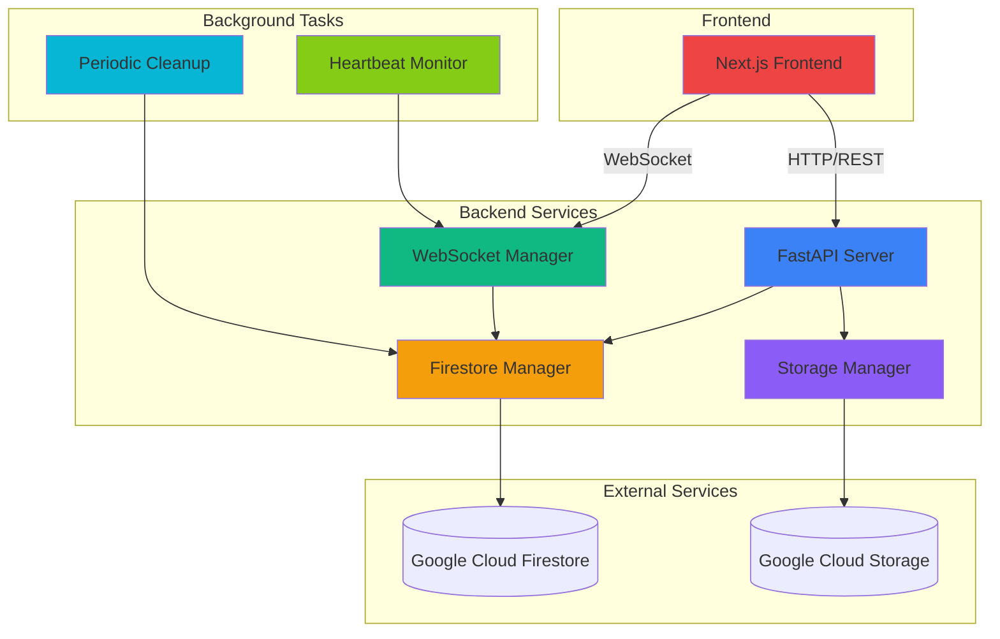
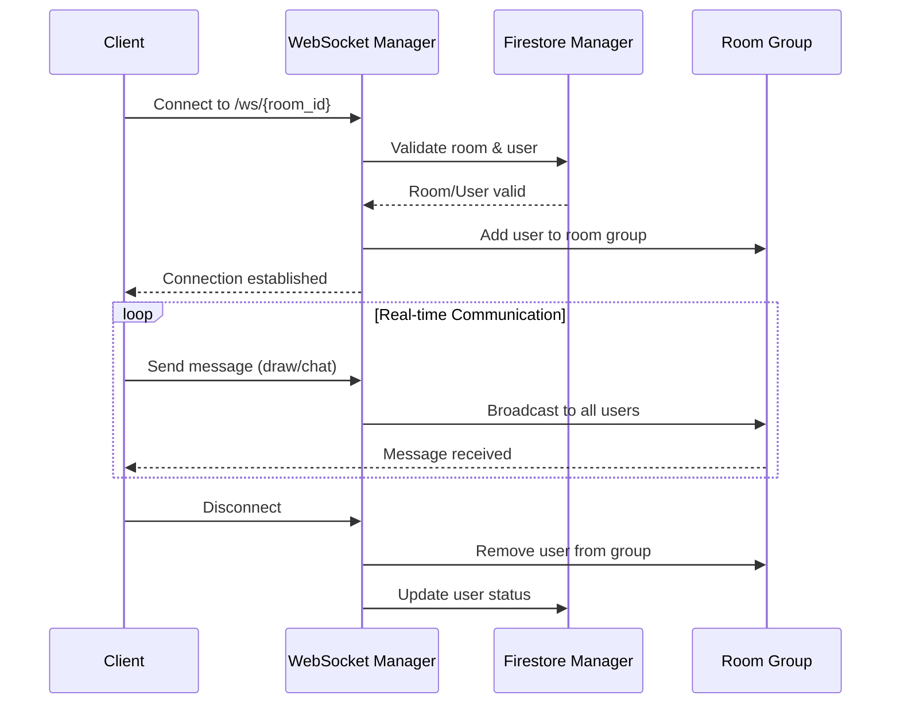
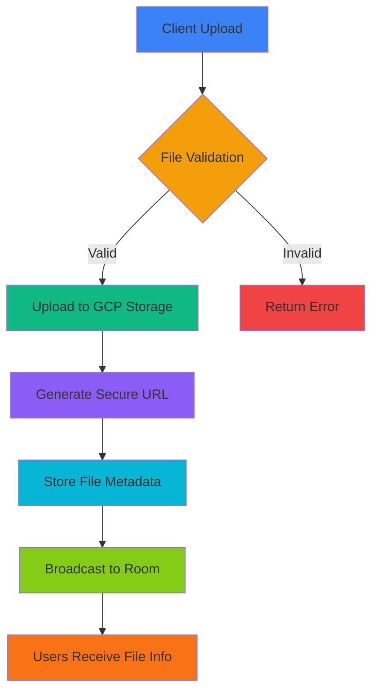
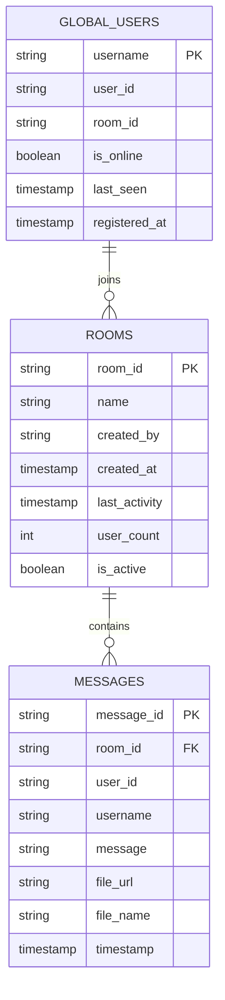
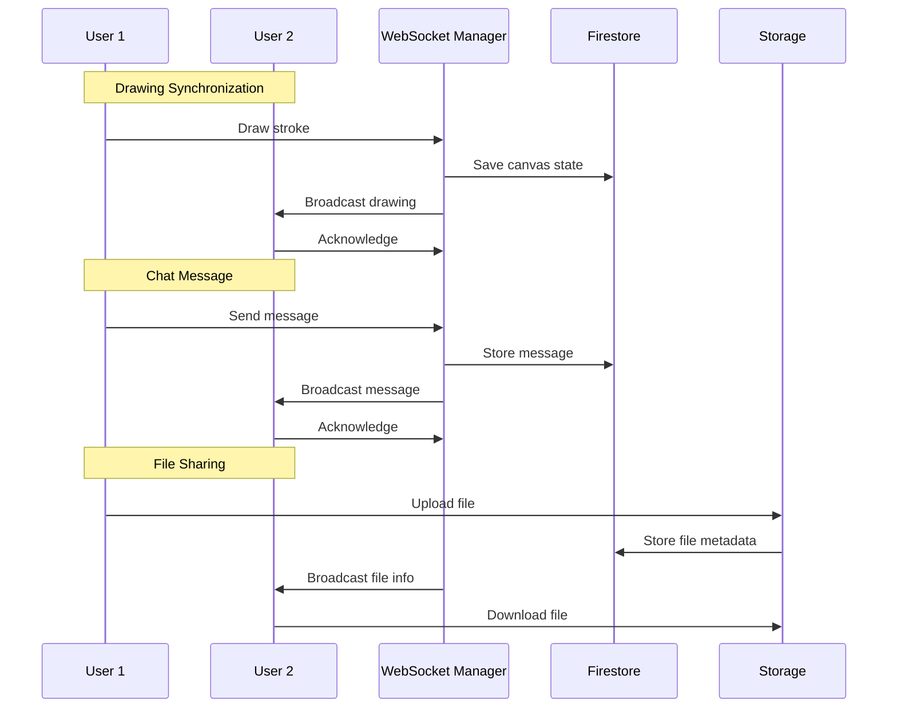
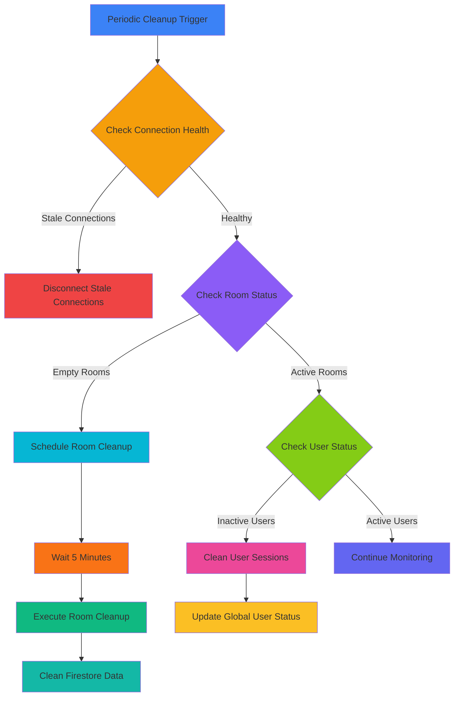

# Collaborative App Backend

A FastAPI-based backend for real-time collaborative whiteboard and chat application with file sharing capabilities.

## 🏗️ Architecture

### System Architecture



### Core Components

```
backend/
├── app/
│   ├── main.py              # FastAPI application & CORS middleware
│   ├── models.py            # Pydantic data models
│   ├── websocket.py         # WebSocket connection manager
│   ├── storage.py           # Google Cloud Storage integration
│   └── firestore_manager.py # Firestore database operations
├── requirements.txt         # Python dependencies
├── Dockerfile              # Container configuration
├── env.yaml                # Environment variables (production)
└── env.example             # Environment variables template
```

### Technology Stack

- **FastAPI** - High-performance async web framework
- **WebSocket** - Real-time bidirectional communication
- **Google Cloud Firestore** - NoSQL database for rooms and users
- **Google Cloud Storage** - File storage and retrieval
- **Uvicorn** - ASGI server for production
- **Pydantic** - Data validation and serialization

## 🔄 How It Works

### 1. WebSocket Connection Management

The backend maintains real-time connections through WebSocket endpoints:

```python
# WebSocket endpoint: /ws/{room_id}
# Handles:
# - User connections/disconnections
# - Real-time drawing data
# - Chat messages
# - File sharing notifications
```

**Connection Flow:**
1. Client connects to `/ws/{room_id}`
2. Backend validates room and user
3. User joins room's WebSocket group
4. Real-time data broadcast to all room members



### 2. Room Management

Rooms are persistent entities stored in Firestore:

```python
# Room Structure:
{
  "room_id": "unique_room_id",
  "created_at": timestamp,
  "users": ["user1", "user2"],
  "last_activity": timestamp
}
```

**Room Operations:**
- Create new rooms
- Join existing rooms
- Track user presence
- Cleanup inactive rooms

### 3. File Upload System

Files are uploaded to Google Cloud Storage with secure access:

```python
# File Upload Flow:
1. Client uploads file via POST /upload
2. Backend validates file type and size
3. File stored in GCP Storage bucket
4. Secure download URL generated
5. File info broadcast to room via WebSocket
```

**File Validation:**
- Allowed types: images (JPEG, PNG, GIF, WebP, BMP, SVG) and PDFs
- Maximum size: 10MB
- Secure URL generation with expiration



### 4. User Management

Users are tracked across sessions:

```python
# User Operations:
- Username availability checking
- Session persistence
- Real-time presence tracking
- Automatic cleanup of inactive users
```

## 📡 API Endpoints

### WebSocket
- `GET /ws/{room_id}` - Real-time communication endpoint

### REST API
- `GET /health` - Health check endpoint
- `POST /users/check` - Check username availability
- `POST /upload` - File upload endpoint
- `GET /rooms/{room_id}/users` - Get room participants

## 🔧 Configuration

### Environment Variables

```yaml
# GCP Configuration
GCP_BUCKET_NAME: "your-storage-bucket"
PROJECT_ID: "your-gcp-project"

# CORS Configuration
ALLOWED_ORIGINS: "https://your-frontend-domain.com,http://localhost:3000"

# File Upload Configuration
ALLOWED_FILE_TYPES: "image/jpeg,image/png,image/gif,image/webp,image/bmp,image/svg+xml,application/pdf"
MAX_FILE_SIZE: "10485760"  # 10MB

# Cleanup Configuration
USER_CLEANUP_INTERVAL: "300"  # 5 minutes
ROOM_CLEANUP_INTERVAL: "3600" # 1 hour
```

### CORS Configuration

The backend uses centralized CORS middleware:

```python
# CORS is configured once in main.py
# No need to add headers to individual endpoints
# Supports multiple frontend domains
```

## 🗄️ Database Schema

### Firestore Collections

#### Rooms Collection
```python
{
  "room_id": str,           # Unique room identifier
  "created_at": timestamp,  # Room creation time
  "users": List[str],       # Active users in room
  "last_activity": timestamp # Last activity time
}
```

#### Users Collection (for cleanup tracking)
```python
{
  "username": str,          # Username
  "last_seen": timestamp,   # Last activity time
  "room_id": str           # Current room
}
```

### Database Relationships



## 🔄 Real-time Data Flow

### Drawing Synchronization
1. User draws on whiteboard
2. Frontend sends drawing data via WebSocket
3. Backend broadcasts to all users in room
4. Other users receive and render drawing

### Chat Messages
1. User sends message
2. Message broadcast to room via WebSocket
3. All users receive message in real-time
4. Message includes timestamp and sender info

### File Sharing
1. User uploads file via REST API
2. File stored in GCP Storage
3. File info broadcast via WebSocket
4. Users receive file preview and download link

### Data Flow Architecture



## 🧹 Cleanup System

### Periodic Cleanup Strategy

The backend implements a comprehensive multi-layered cleanup system to maintain performance and data integrity:

#### 1. **Automatic Background Cleanup**
```python
# Runs every 60 seconds (configurable via CLEANUP_SCHEDULER_INTERVAL)
async def periodic_cleanup():
    while True:
        await asyncio.sleep(cleanup_interval)
        manager.trigger_cleanup_if_needed()
```

#### 2. **Connection Health Monitoring**
```python
# Heartbeat System
- WebSocket connections send heartbeat every 30 seconds
- Connections without heartbeat for 5+ minutes are marked as stale
- Stale connections are automatically disconnected
- Prevents zombie connections from consuming resources
```

#### 3. **Room Cleanup Strategy**
```python
# Room Lifecycle Management
- Empty rooms are scheduled for cleanup after 5 minutes (ROOM_CLEANUP_DELAY)
- Cleanup includes:
  * In-memory canvas state removal
  * Active strokes cleanup
  * Firestore room data deletion
  * User list cleanup
```

#### 4. **User Cleanup Strategy**
```python
# User Session Management
- Auto-generated users (e.g., "User123") are cleaned up immediately when disconnected
- Global user registration prevents username conflicts
- Users inactive for 2+ minutes have their usernames freed
- Duplicate users in same room are automatically removed
```

### Cleanup Layers

```mermaid
graph TB
    subgraph "Layer 1: Connection-Level"
        HB[Heartbeat Monitor]
        SC[Stale Connection Detection]
        TO[Connection Timeout]
    end
    
    subgraph "Layer 2: Room-Level"
        ER[Empty Room Detection]
        SR[Scheduled Room Cleanup]
        DC[Data Cleanup]
    end
    
    subgraph "Layer 3: User-Level"
        GU[Global User Tracking]
        SU[Session Cleanup]
        DP[Duplicate Prevention]
    end
    
    subgraph "Layer 4: Data-Level"
        OF[Orphaned File Cleanup]
        OD[Orphaned Data Cleanup]
        ST[Stuck User Cleanup]
    end
    
    HB --> SC
    SC --> TO
    ER --> SR
    SR --> DC
    GU --> SU
    SU --> DP
    OF --> OD
    OD --> ST
    
    style HB fill:#3b82f6
    style SC fill:#10b981
    style TO fill:#f59e0b
    style ER fill:#8b5cf6
    style SR fill:#06b6d4
    style DC fill:#84cc16
    style GU fill:#ef4444
    style SU fill:#f97316
    style DP fill:#ec4899
    style OF fill:#6366f1
    style OD fill:#14b8a6
    style ST fill:#fbbf24
```



#### **Layer 1: Connection-Level Cleanup**
- **Heartbeat monitoring**: Tracks active WebSocket connections
- **Stale connection removal**: Disconnects inactive connections
- **Connection timeout**: 5-minute timeout for connections without heartbeat

#### **Layer 2: Room-Level Cleanup**
- **Empty room detection**: Identifies rooms with no active users
- **Scheduled cleanup**: Rooms scheduled for cleanup after 5 minutes of being empty
- **Data cleanup**: Removes canvas state, strokes, and Firestore data

#### **Layer 3: User-Level Cleanup**
- **Global user tracking**: Maintains username availability across all rooms
- **Session cleanup**: Removes users when they disconnect
- **Duplicate prevention**: Prevents same username in multiple rooms

#### **Layer 4: Data-Level Cleanup**
- **Orphaned file cleanup**: Removes files without associated messages
- **Orphaned data cleanup**: Removes Firestore documents without references
- **Stuck user cleanup**: Removes users stuck in rooms after server restarts

### Cleanup Process Flow



### Cleanup Configuration

```yaml
# Environment Variables for Cleanup
CLEANUP_SCHEDULER_INTERVAL: "60"        # Cleanup check interval (seconds)
ROOM_CLEANUP_DELAY: "300"              # Room cleanup delay (seconds)
WEBSOCKET_CONNECTION_TIMEOUT: "300000"  # Connection timeout (milliseconds)
```

### Manual Cleanup Endpoints

```bash
# Available cleanup endpoints:
POST /cleanup                    # Basic connection cleanup
POST /cleanup/auto-users         # Clean auto-generated users
POST /cleanup/room/{room_id}     # Clean specific room
POST /cleanup/orphaned-files     # Clean orphaned files
POST /cleanup/comprehensive      # Full system cleanup
POST /cleanup/force-stuck-users  # Force cleanup stuck users
GET  /cleanup/status            # Check cleanup status
```

### Cleanup Monitoring

#### **Real-time Monitoring**
```python
# Cleanup logs show:
- 🕐 Periodic cleanup checks
- 🧹 Rooms being cleaned up
- 💓 Heartbeat monitoring
- ✅ Successful cleanups
- ❌ Cleanup errors
```

#### **Cleanup Statistics**
```python
# Available metrics:
- Active connections per room
- Scheduled cleanup rooms
- Stale connections count
- Orphaned data count
- Cleanup success/failure rates
```

### Cleanup Safety Features

#### **Graceful Disconnection**
- Connections are closed with specific close codes
- Users are notified before cleanup
- No data loss during cleanup

#### **Error Handling**
- Cleanup failures don't crash the system
- Retry mechanisms for failed cleanups
- Fallback cleanup strategies

#### **Data Integrity**
- Firestore transactions ensure data consistency
- Backup mechanisms for critical data
- Rollback capabilities for failed cleanups

## 🔒 Security Features

### CORS Protection
- Whitelist-based origin validation
- Prevents unauthorized cross-origin requests
- Centralized configuration

### File Security
- File type validation
- Size limits enforcement
- Secure URL generation
- No direct bucket access

### Input Validation
- Pydantic models for data validation
- Username sanitization
- Room ID validation

## 🚀 Performance Optimizations

### WebSocket Efficiency
- Connection pooling
- Efficient message broadcasting
- Minimal data transfer

### Database Optimization
- Indexed queries on room_id and username
- Batch operations for cleanup
- Efficient user presence tracking

### File Handling
- Streaming uploads
- Async file operations
- Efficient URL generation

## 🐛 Error Handling

### WebSocket Errors
- Connection timeout handling
- Graceful disconnection
- Error message broadcasting

### File Upload Errors
- Validation error responses
- Storage error handling
- User-friendly error messages

### Database Errors
- Connection retry logic
- Fallback mechanisms
- Error logging

## 📊 Monitoring

### Health Checks
- `/health` endpoint for uptime monitoring
- Database connectivity checks
- Storage access verification

### Logging
- Request/response logging
- Error tracking
- Performance metrics

## 🔧 Development

### Local Setup
```bash
# Install dependencies
pip install -r requirements.txt

# Set up environment
cp env.example .env
# Edit .env with your configuration

# Run development server
uvicorn app.main:app --reload --host 0.0.0.0 --port 8000
```

### Testing
```bash
# Health check
curl http://localhost:8000/health

# WebSocket test
# Use WebSocket client to connect to ws://localhost:8000/ws/test-room
```

### Docker
```bash
# Build image
docker build -t collaborative-backend .

# Run container
docker run -p 8000:8000 collaborative-backend
```

## 📝 Key Implementation Details

### WebSocket Manager
- Manages multiple room connections
- Handles user join/leave events
- Broadcasts messages to room members
- Maintains connection state

### Storage Integration
- Async file operations
- Secure URL generation
- Error handling and retries
- File metadata management

### Database Operations
- CRUD operations for rooms and users
- Real-time data synchronization
- Cleanup and maintenance tasks
- Connection pooling

### CORS Middleware
- Centralized configuration
- Multiple origin support
- Preflight request handling
- Security headers

This backend is designed for scalability, reliability, and real-time performance while maintaining security and data integrity. 